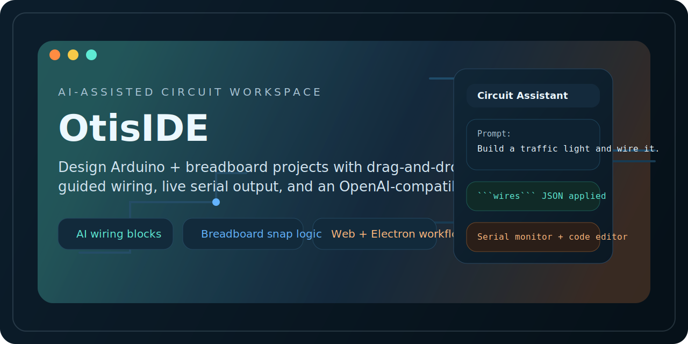
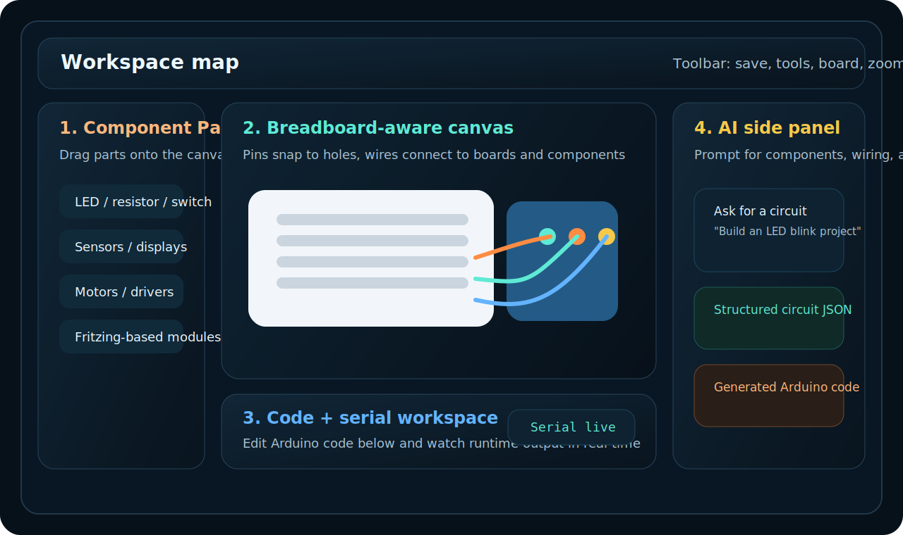

# AI Arduino Circuit

<p align="center">
  
</p>

<p align="center">
  <a href="https://github.com/22507260/AI-Arduino-Circuit/actions/workflows/ci.yml">
    
  </a>
  <a href="https://github.com/22507260/AI-Arduino-Circuit/blob/main/LICENSE">
    
  </a>
  <a href="https://www.typescriptlang.org/">
    
  </a>
  <a href="https://react.dev/">
    
  </a>
  <a href="https://www.electronjs.org/">
    
  </a>
  <a href="https://buymeacoffee.com/otis21">
    
  </a>
</p>

<p align="center">
  AI-assisted Arduino and breadboard design workspace with drag-and-drop components, board-aware wiring, lightweight runtime feedback, and OpenAI-compatible circuit help.
</p>

<p align="center">
  <a href="#quick-start"><strong>Quick start</strong></a>
  |
  <a href="#feature-set"><strong>Feature set</strong></a>
  |
  <a href="#workspace-layout"><strong>Workspace layout</strong></a>
  |
  <a href="#support-the-project"><strong>Support the project</strong></a>
</p>

## Why This Project

AI Arduino Circuit focuses on the part that most makers actually want to do quickly: lay out a circuit, connect the right pins, test the basic logic, and iterate with an assistant that can generate both wiring and Arduino code.

It is designed for:

- fast prototyping
- classroom demos and beginner education
- hardware brainstorming with AI-assisted scaffolding
- building browser-first or Electron desktop workflows

## Workspace Preview

<p align="center">
  
</p>

## Feature Set

| Area | What you get |
| --- | --- |
| Canvas | Drag-and-drop components, breadboard-aware snapping, pin-level connection points, contextual right-click actions |
| Wiring | Direct wiring between Arduino pins, breadboard holes, and component pins with selectable wire colors |
| Boards | Arduino Uno, Nano, Mega, Leonardo, Deneyap Kart 1A v2, NodeMCU ESP8266, SparkFun Pro Micro, Raspberry Pi Pico, and HUZZAH32 support with board-specific hotspot maps |
| AI Assistant | OpenAI-compatible chat panel that can return circuit JSON, wire JSON, and Arduino sketches |
| Runtime | Lightweight mock runtime for simple `digitalWrite`, `delay`, `Serial.print`, and LED blink flows |
| Persistence | Save/load project JSON, local AI chat history, and PNG export support in Electron |
| UX | English and Turkish UI, improved code workspace, live serial monitor, focused desktop-style panel layout |

## What The AI Panel Can Do

The assistant is not only a chat box. It can parse structured answers and apply them directly to the canvas:

- add new components with a `circuit` JSON block
- create connections with a `wires` JSON block
- write Arduino code with an `arduino` code fence
- inspect the current board and existing components before answering

Example prompts:

```text
Build an LED blink circuit and add the wiring too
Create a traffic light circuit and wire it to Arduino
Inspect the current circuit and complete any missing wires
```

## Quick Start

### Requirements

- Node.js 20+
- npm

### Install

```bash
npm install
```

### Run the web app

```bash
npm run dev
```

### Run the Electron desktop app

```bash
npm run electron:dev
```

### Build the web bundle

```bash
npm run build
```

### Build Electron

```bash
npm run electron:build
```

## AI Setup

The project uses an OpenAI-compatible `chat/completions` flow. Out of the box, the app supports:

- Groq
- OpenAI
- Google Gemini
- custom OpenAI-compatible endpoints

You can configure:

- API key
- model
- base URL

In Electron mode, AI requests are proxied through the main process to reduce browser CORS issues.

## Workspace Layout

1. Left panel: component palette with categorized parts
2. Center canvas: breadboard, selected board, components, wires
3. Right panel: properties editor and AI assistant
4. Bottom workspace: Arduino code editor and serial monitor

This layout keeps the visual circuit, code, and AI guidance visible at the same time.

## Component Coverage

The library includes core electronics plus a large set of Fritzing-based modules, including:

- LED, RGB LED, resistor, capacitor, diode
- button, switch, potentiometer, joystick
- buzzer, servo, DC motor, stepper, L298N, ULN2003
- DHT11, PIR, flame sensor, MQ-2, HC-SR04, ACS712
- OLED I2C, LCD, 7-segment, TM1637, MAX7219 matrix
- HC-05, RC522, ESP8266, microSD, DS3231 RTC, OV7670
- breadboard power modules, logic-level converters, RF modules, and more

## Project Structure

| Path | Purpose |
| --- | --- |
| `src/components/CircuitCanvas.tsx` | Main circuit interaction layer, drag/drop, wiring, board rendering, context menu |
| `src/components/AIPanel.tsx` | AI chat UI, structured response parsing, conversation history |
| `src/components/BottomPanel.tsx` | Arduino code editor and serial monitor workspace |
| `src/store/circuitStore.ts` | Global Zustand store for circuit state, UI state, simulation, and AI data |
| `src/models/types.ts` | Component catalog, metadata, defaults, and AI provider definitions |
| `src/lib/mockArduinoRuntime.ts` | Lightweight Arduino-style runtime behavior |
| `electron/main.js` | Electron window management, file dialogs, and AI request proxying |

## Current Scope

This is not a full SPICE-grade electrical simulator.

Current priorities are:

- visual layout speed
- breadboard-aware placement
- realistic wiring workflows
- AI-assisted setup
- beginner-friendly runtime feedback

That makes the app especially useful for prototyping, teaching, and fast circuit ideation.

## Roadmap Ideas

- deeper device behavior models
- more board definitions and auto-derived connector maps
- lazy loading for large SVG libraries
- richer runtime emulation for displays, motors, and sensor feedback
- improved project sharing and export formats

## Local Quality Gates

This repository includes a GitHub Actions workflow at `.github/workflows/ci.yml` that runs:

- `npm ci`
- `npm run build`

## Support The Project

If this repo helps you, you can support continued development here:

- Buy Me a Coffee: https://buymeacoffee.com/otis21

You will also see the sponsor button on GitHub thanks to `.github/FUNDING.yml`.
